### Hi there 👋

- Software Developer at SSW Sydney - [ssw.com.au/people/josh-berman](https://ssw.com.au/people/josh-berman)
- Bachelor of Advanced Computing (Computer Science) and Bachelor of Commerce (Finance) at The University of Sydney
- In my free time you'll find me at the beach, surfing or travelling

# 💻 Tech Stack:
                 
# 📊 GitHub Stats:

 

